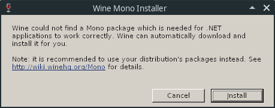
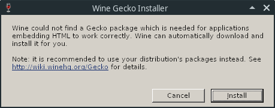
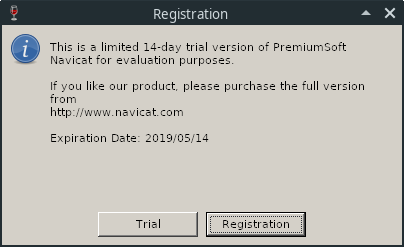

# Navicat Keygen - 如何使用这个注册机？ (Linux)

* 维护者：zenuo, DoubleLabyrinth

---

> 可下载[录屏文件](image/Screen_recording.mp4)参考

1. 切换到解压安装包的路径，本示例解压到了 `家目录`，运行Navicat，使其初始化环境：

    ```console
    $ cd ~/navicat121_premium_en_x64 && \
    ./start_navicat
    ```

    首次启动时，会提示如下两个窗口，点击“Cancel”即可：

    

    

    直至出现 `Registration` 窗口，选择 `Trial`，待加载完成后关闭Navicat，执行 `步骤2`：

    

2. [从这里](https://github.com/DoubleLabyrinth/navicat-keygen/releases)下载最新的release，并且解压：

    > 此处下载的是64位的可执行文件，若您使用32位，请下载对应版本

    ```console
    $ curl -O -L https://github.com/DoubleLabyrinth/navicat-keygen/releases/latest/download/navicat-keygen-for-x64.zip && \
    unzip navicat-keygen-for-x64.zip
    ```

3. 下载 `navicat-pacther.sh` 和 `navicat-keygen.sh`：

    ```console
    $ curl -O -L https://raw.githubusercontent.com/DoubleLabyrinth/navicat-keygen/windows/bash/navicat-patcher.sh && \
    chmod +x navicat-patcher.sh && \
    curl -O -L https://raw.githubusercontent.com/DoubleLabyrinth/navicat-keygen/windows/bash/navicat-keygen.sh && \
    chmod +x navicat-keygen.sh
    ```

4. 使用 `navicat-patcher.exe` 替换掉 `navicat.exe` 和 `libcc.dll` 里的Navicat激活公钥。 

   > 执行此步骤时，请将Navicat关闭

   ```console
   $ ./navicat-patcher.sh
   ```
   
   __Navicat Premium 12.1.22 简体中文版已通过测试__。下面将是一份样例输出：

   ```
   ***************************************************
   *       Navicat Patcher by @DoubleLabyrinth       *
   *                  Version: 4.0                   *
   ***************************************************

   Press Enter to continue or Ctrl + C to abort.

   [+] Try to open Navicat.exe ... Ok!
   [+] Try to open libcc.dll ... Ok!

   [+] PatchSolution0 ...... Ready to apply
       [*] Patch offset = +0x029bccd8
   [+] PatchSolution1 ...... Ready to apply
       [*] [0] Patch offset = +0x02206c00
       [*] [1] Patch offset = +0x0074c489
       [*] [2] Patch offset = +0x02206910
       [*] [3] Patch offset = +0x0074c46f
       [*] [4] Patch offset = +0x02206904
   [-] PatchSolution2 ...... Omitted
   [+] PatchSolution3 ...... Ready to apply
       [*] [  0] Instruction RVA = 0x016539c8, Patch Offset = +0x023e64d4
       [*] [  1] Instruction RVA = 0x01653a1f, Patch Offset = +0x01652e23
       [*] [  2] Instruction RVA = 0x01653a25, Patch Offset = +0x01652e28
       [*] [  3] Instruction RVA = 0x01653a8c, Patch Offset = +0x01652e8e
       ...
       ...
       ...
       [*] [108] Instruction RVA = 0x016604e1, Patch Offset = +0x023e66d8
       [*] [109] Instruction RVA = 0x01660518, Patch Offset = +0x0165f91c
       [*] [110] Instruction RVA = 0x0166051e, Patch Offset = +0x0165f921

   [*] PatchSolution0 is suppressed in order to keep digital signature valid.

   [*] Generating new RSA private key, it may take a long time...
   [*] Your RSA public key:
   -----BEGIN PUBLIC KEY-----
   MIIBIjANBgkqhkiG9w0BAQEFAAOCAQ8AMIIBCgKCAQEA1hV66HgU4LrKXWW6O7bK
   AN6ZTr5W+Mq8ClTQ+Pc+BdhLu6rww55kVq7OXKGpvx0G4eTafYMGrrBETgDSTaMq
   Bx+8bZbGBWh2LtNfqU+xUrpHHBSz0ByBc3iTEzzthJl+Fzf8suDX2lWYIc/Ym/eW
   YtxdJ7xOzLb68z4N0zVmA0jFX2FOm75DRYgKqy4SGixapfucL9dVaWVLTUdbrVdj
   4LX78t4t5ykbYoThrat4yuLvj/BxLaQ6ivKD+ScfHdtCoY+NA5jmBoUfBq3Q1SXB
   iNaoXctbi0/H3MiPu0cRojryAocooF89yFm5/mNnzWGAYPr6DvBI8CDTZmjaQ4oC
   aQIDAQAB
   -----END PUBLIC KEY-----

   *******************************************************
   *                   PatchSolution1                    *
   *******************************************************
   [*] Previous:
   +0x0000000002206c00  44 37 35 31 32 35 42 37 30 37 36 37 42 39 34 31  D75125B70767B941
   +0x0000000002206c10  34 35 42 34 37 43 31 43 42 33 43 30 37 35 35 45  45B47C1CB3C0755E
   +0x0000000002206c20  37 43 43 42 38 38 32 35 43 35 44 43 45 30 43 35  7CCB8825C5DCE0C5
   ...
   ...
   [*] After:
   +0x0000000002206c00  33 43 32 39 30 39 35 38 33 34 38 41 42 43 35 39  3C290958348ABC59
   +0x0000000002206c10  36 44 39 30 43 45 45 38 31 36 42 36 39 38 34 44  6D90CEE816B6984D
   +0x0000000002206c20  35 32 35 34 37 45 30 32 34 31 42 36 42 43 31 41  52547E0241B6BC1A
   ...
   ...

   [*] Previous:
   +0x000000000074c480                             fe ea bc 01                    ....
   [*] After:
   +0x000000000074c480                             08 00 00 00                    ....

   [*] Previous:
   +0x0000000002206910  45 31 43 45 44 30 39 42 39 43 32 31 38 36 42 46  E1CED09B9C2186BF
   +0x0000000002206920  37 31 41 37 30 43 30 46 45 32 46 31 45 30 41 45  71A70C0FE2F1E0AE
   +0x0000000002206930  46 33 42 44 36 42 37 35 32 37 37 41 41 42 32 30  F3BD6B75277AAB20
   ...
   ...
   [*] After:
   +0x0000000002206910  41 33 39 42 41 36 43 34 31 36 33 32 35 30 46 45  A39BA6C4163250FE
   +0x0000000002206920  42 32 41 39 31 41 34 32 46 44 42 46 30 41 32 31  B2A91A42FDBF0A21
   +0x0000000002206930  33 34 46 34 36 44 43 45 34 30 42 46 41 42 33 35  34F46DCE40BFAB35
   ...
   ...

   [*] Previous:
   +0x000000000074c460                                               59                 Y
   +0x000000000074c470  08 01 00                                         ...
   [*] After:
   +0x000000000074c460                                               06                 .
   +0x000000000074c470  00 00 00                                         ...

   [*] Previous:
   +0x0000000002206900              39 32 39 33 33                           92933
   [*] After:
   +0x0000000002206900              42 34 34 33 38                           B4438

   *******************************************************
   *                   PatchSolution3                    *
   *******************************************************
   [*] +023e64d4: 4d 49 49 ---> 4d 49 49
   [*] +01652e23: 42 49 ---> 42 49
   [*] +01652e28: 6a ---> 6a
   ...
   ...
   ...
   [*] +023e66d8: 77 49 44 41 ---> 51 49 44 41
   [*] +0165f91c: 51 41 ---> 51 41
   [*] +0165f921: 42 ---> 42

   [*] New RSA-2048 private key has been saved to
   C:\Users\DoubleSine\github.com\navicat-keygen\bin\x64-Release\RegPrivateKey.pem

   *******************************************************
   *           PATCH HAS BEEN DONE SUCCESSFULLY!         *
   *                  HAVE FUN AND ENJOY~                *
   *******************************************************
   ```

5. 接下来使用`navicat-keygen.exe`来生成序列号和激活码

   ```console
   $ ./navicat-keygen.sh
   ```

   你会被要求选择Navicat产品类别、语言以及输入主版本号。之后会随机生成一个序列号。

   ```
   Select Navicat product:
   0. DataModeler
   1. Premium
   2. MySQL
   3. PostgreSQL
   4. Oracle
   5. SQLServer
   6. SQLite
   7. MariaDB
   8. MongoDB
   9. ReportViewer

   (Input index)> 1

   Select product language:
   0. English
   1. Simplified Chinese
   2. Traditional Chinese
   3. Japanese
   4. Polish
   5. Spanish
   6. French
   7. German
   8. Korean
   9. Russian
   10. Portuguese

   (Input index)> 1

   (Input major version number, range: 0 ~ 15, default: 12)> 12

   Serial number:
   NAVO-2ORP-IN5A-GQEE

   Your name: 
   ```

   你可以使用这个序列号暂时激活Navicat。

   接下来你会被要求输入`用户名`和`组织名`；请随便填写，但不要太长。

   ```
   Your name: DoubleLabyrinth
   Your organization: DoubleLabyrinth
   Input request code (in Base64), input empty line to end:
   ```
 
   之后你会被要求填入请求码。注意 __不要关闭命令行__.

6. 配置一个不存在的`代理`。找到`注册`窗口，并填入keygen给你的序列号。然后点击`激活`按钮。

7. 在线激活失败，这时候Navicat会询问你是否`手动激活`，直接选吧。

8. 在`手动激活`窗口你会得到一个请求码，复制它并把它粘贴到keygen里。最后别忘了连按至少两下回车结束输入。

   ```
   Your name: DoubleLabyrinth
   Your organization: DoubleLabyrinth

   Input request code (in Base64), input empty line to end:
   t2U+0yfE2FfnbjyhCXa0lglZOHu9Ntc3qyGiPbR6xb1QoU63/9BVfdaCq0blwVycXPyT/Vqw5joIKdM5oCRR/afCPM7iRcyhQMAnvqwc+AOKCqayVV+SqKLvtR/AbREI12w++PQ6Ewfs4A8PgB8OJ9G0jKt6Q/iJRblqi2WWw9mwy+YHcYYh3UAfygTnyj/xl+MzRymbY0lkus+6LPtpDecVsFFhM7F32Ee1QPwISko7bAkHOtkt+joPfYDdn9PDGZ4HEmeLvH6UqZCXkzgaAfynB7cQZFEkId8FsW2NGkbpM7wB2Hi3fNFgOIjutTprixTdbpFKn4w6gGc28ve23A==

   Request Info:
   {"K":"NAVO2ORPIN5AGQEE", "DI":"R91j6WyMhxHznAKSxxxx", "P":"WIN"}

   Response Info:
   {"K":"NAVO2ORPIN5AGQEE","DI":"R91j6WyMhxHznAKSxxxx","N":"DoubleLabyrinth","O":"DoubleLabyrinth","T":1547826060}

   License:
   lRF18o+ZhBphyN0U5kFLHtAAGGXuvhqOcxNuvAk4dJcGeR0ISuw74mQvAfdNjv0T
   I5NZFzqIJvrzM0XeR88q+3kmZkECuxwwWHP3zzDPhPiylcTV4DoGZ1tfoViUSYQc
   LgXG0Fl7koZeP61YOKQ8GfX+Xk2ZTM64bYaF7NlhonM+GQUJCCF2JThmrP921t2p
   b/E5pV6fLOYMM13881ZQcQcltMNVDZn4lzgzKRFFxCQFaTl6fJMHZdYVmICQTHtI
   sNaym0zduc8/cv34mgJ+7NseXmsEPCdjrZ59wgfPsLhZLXqtfxi5hGWw4NMa3Sb2
   UI8dzqFzRp/hSDEM0mEqiA==
   ```

9. 如果不出意外，你会得到一个看似用Base64编码的激活码。直接复制它，并把它粘贴到Navicat的`手动激活`窗口，最后点`激活`按钮。如果没什么意外的话应该能成功激活。别忘了关闭我们刚刚设置的不存在的代理哦。

